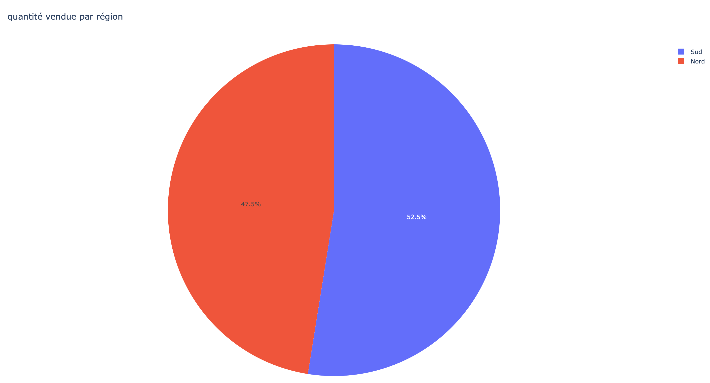
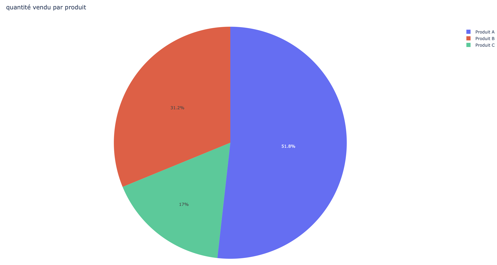
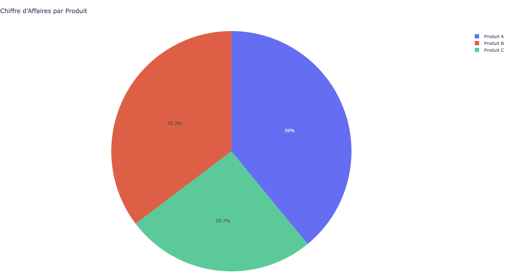
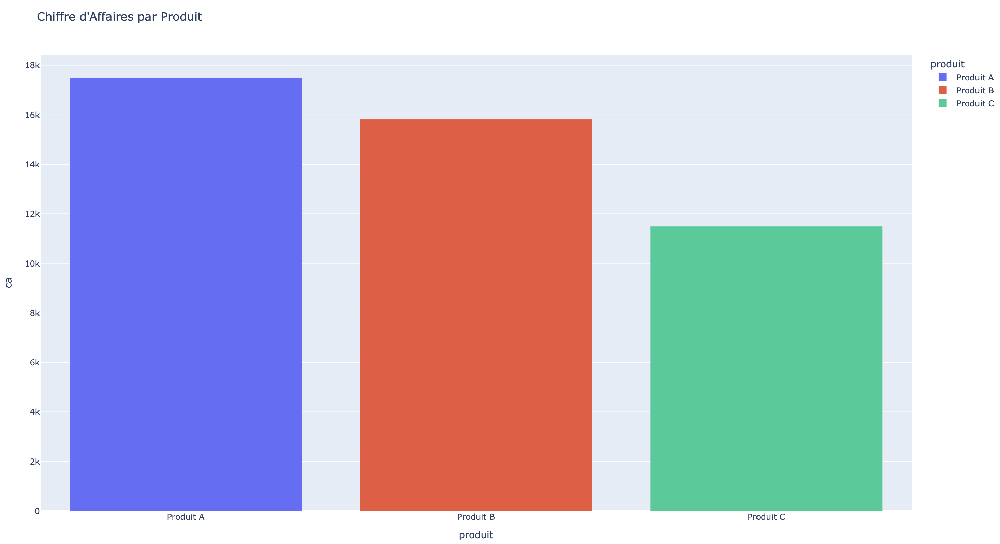

````markdown
# 🧠 Projet de Visualisation et d’Analyse des Ventes

Il s’agit d’un projet de **visualisation de données** développé en **Python**, à l’aide de deux bibliothèques principales : **pandas** et **plotly**.

---

## Analyse SQL (résultats clés)

Les premières analyses ont été effectuées dans l’environnement [SQLite Online](https://sqliteonline.com/) à partir de la table `ventes`.

### a. Chiffre d’affaires total

Le chiffre d’affaires (CA) global de l’ensemble des transactions s’élève à **44 825 €**.

| Métrique | Requête SQL | Résultat |
|-----------|--------------|----------|
| CA total | `SELECT SUM(prix * qte) FROM ventes;` | **44 825 €** |

---

### b. Ventes par produit et par région (quantité)

Requêtes utilisées pour agréger les quantités vendues :

```sql
-- Par produit :
SELECT produit, SUM(qte) AS quantite_totale
FROM ventes
GROUP BY produit;

-- Par région :
SELECT region, SUM(qte) AS quantite_totale
FROM ventes
GROUP BY region;
````

| Dimension   | Quantité totale (QTE) |
| ----------- | --------------------- |
| Produit A   | 1 750                 |
| Produit B   | 1 055                 |
| Produit C   | 575                   |
| Région Nord | 1 475                 |
| Région Sud  | 1 805                 |

**Conclusion :**
Le **Produit A** est le plus vendu, et la **Région Sud** enregistre le volume de ventes le plus élevé, légèrement supérieur à celui de la Région Nord (≈ **5 %** d’écart).

---

## Visualisation avec Python et Plotly

Le fichier `app.py` implémente le calcul du chiffre d’affaires et génère les visualisations.

### Graphique 1 : Ventes par région

**Objectif :** Visualiser la répartition des ventes entre les deux régions.
**Analyse :** La **Région Sud** domine légèrement (≈ **5 %** d’écart).


### Graphique 2 : Ventes par produit

**Objectif :** Comparer le volume d’unités vendues par produit.
**Analyse :** Le **Produit A** domine avec **1 750** unités, tandis que le **Produit C** est le moins vendu (**575**).


### Graphique 3 : Chiffre d’affaires par produit

**Objectif :** Comparer la valeur totale générée par chaque produit.
**Analyse :** Le **Produit A** génère **17 500 €**, et le **Produit B** atteint **15 825 €** grâce à un **prix unitaire plus élevé**, malgré un volume inférieur.


### Graphique 4 : Chiffre d’affaires (diagramme en barres)

**Objectif :** Mettre en évidence les montants du chiffre d’affaires sur l’axe vertical (Y) pour une lecture plus claire.

```
```
